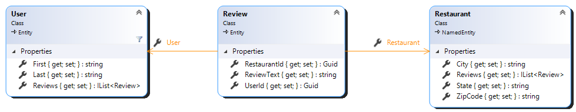

RestaurantReviews
=================

# Luke's Solution

All class diagrams were generated using the [Class Diagram tool](https://docs.microsoft.com/en-us/visualstudio/ide/class-designer/how-to-add-class-diagrams-to-projects?view=vs-2019) in Visual Studio 2019.  The persistence layer users EF Core Code First Migrations to create a local SQL database.  Some initial data is pre-seeded into the database.  There are some basic unit tests to illustrate capability, but these tests are not intended to be exhaustive.

## Project Structure / Architecture
- Data - Data tier, built with EF Core
- Logic - Core business logic, and anti-corruption layer so that the database implementation details don't "leak" into the web tier
- Web - Thin layer to expose the core business logic as a REST API

## TODO
- Post a review for a restaurant
- Delete a review
- A couple of integration unit tests for controllers

## Notes
- Currently, the project is configured to automatically drop/re-create the database each time.  You can set the DropDb variable = false in project properties or run without the debugger to avoid this behavior.

## Possible Future Enhancements
- Authentication/Authorization
- API Versioning
- Should also include street address when checking for duplicate restaurants
- Would be good to use an address standardization service when checking for duplicate restaurants
- Moderator review/approval of reviews
- User signup/verification

# Original Requirements
The Problem
--------------
We are in the midst of building a mobile application that will let restaurant patrons rate the restaurant in which they are eating. As part of the build, we need to develop a web API that will accept and store the ratings and other sundry data from a publicly accessible interface. 

For this project, we would like you to build this API. Feel free to add your own twists and ideas to what type of data we should collect and return, but at a minimum your API should be able to:

1. Get a list of restaurants by city
2. Post a restaurant that is not in the database
3. Post a review for a restaurant
4. Get of a list of reviews by user
5. Delete a review

The Fine Print
--------------
Please use whatever techniques you feel are applicable to solve the problem. We suggest that you approach this exercise as if this code was part of a larger system. The end result should be representative of your abilities and style.  We prefer that you submit your solution in a language targeting the .NET Framework to help us better evaluate your code.

Please fork this repository. If your solution involves code auto generated by a development  tool, please commit it separately from your own work.  When you have completed your solution, please issue a pull request to notify us that you are ready.

Have fun.
